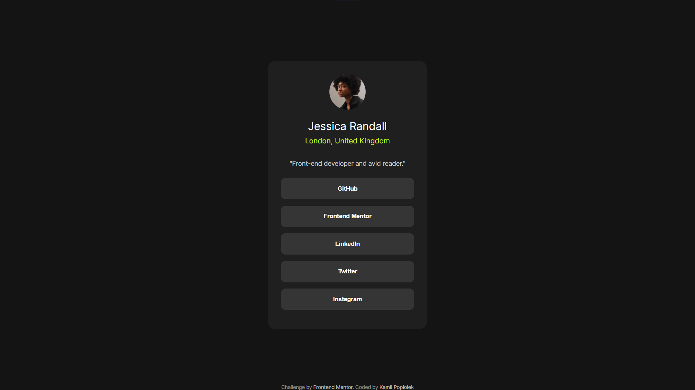

# Frontend Mentor - Social links profile solution

This is a solution to the [Social links profile challenge on Frontend Mentor](https://www.frontendmentor.io/challenges/social-links-profile-UG32l9m6dQ). Frontend Mentor challenges help you improve your coding skills by building realistic projects.

## Table of contents

- [Overview](#overview)
  - [The challenge](#the-challenge)
  - [Screenshot](#screenshot)
  - [Links](#links)
- [My process](#my-process)
  - [Built with](#built-with)
  - [Continued development](#continued-development)
  - [Useful resources](#useful-resources)
- [Author](#author)

**Note: Delete this note and update the table of contents based on what sections you keep.**

## Overview

### The challenge

Users should be able to:

- See hover and focus states for all interactive elements on the page

### Screenshot

### Links

- Solution URL: [Add solution URL here](https://your-solution-url.com)
- Live Site URL: [Add live site URL here](https://social-links-profile-itzl1m4k.vercel.app/)

### Built with

- Built with HTML5 and CSS, with some basic knowledge of both.

### Continued development

I plan to continue focusing on the following areas in future projects:

- Improving my understanding of CSS custom properties
- Enhancing my skills with Flexbox

### Useful resources

- Author: "Bro Code" (<https://www.youtube.com/watch?v=HGTJBPNC-Gw>) was very helpful for me. I found it clarifying and informative, even though it's quite lengthy. Its focus on HTML and CSS was very helpful.

## Author

- Website - [Kamil Popiołek](https://github.com/itzL1m4k)
- Frontend Mentor - [@itzL1m4k](https://www.frontendmentor.io/profile/itzL1m4k)
